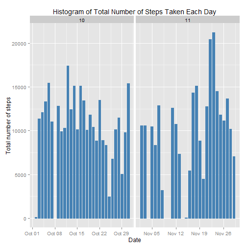
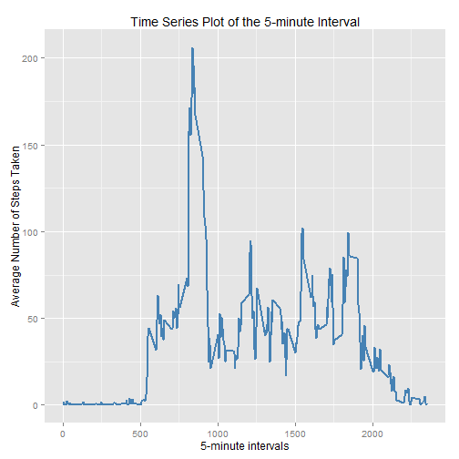
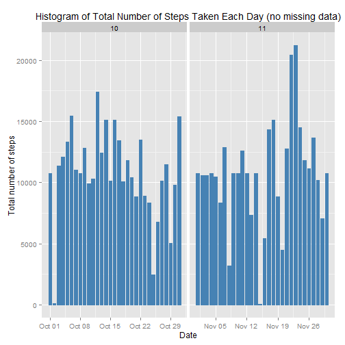

# Reproducible Research - Course Project  
### Hovig Charchaflian - June 2015  

## Introduction  
This is the first of two Course Projects for the Reproducible Research course at Johns Hopkins hosted by Coursera. The dataset for this project is a comma-separated (.CSV) file that can be found [here] (/https://d396qusza40orc.cloudfront.net/repdata%2Fdata%2Factivity.zip).

The dataset represents the measurements of a wearable tech device on one anonymous user over the course of 30 days. The three columns of the dataset are:  

* steps: Number of steps taking in a 5-minute interval (missing values are coded as NA)  
* date: The date on which the measurement was taken in YYYY-MM-DD format  
* interval: Identifier for the 5-minute interval in which measurement was taken  

This document serves as a practice assignment in manipulating and summarizing the dataset according to the guidelines as well as practice in generating an R markdown file using knitr. The filename for the dataset is *activity.csv* and will be referred to as such in the remainder of this document.  


## Loading and preprocessing the data  
Before we even touch the data let's load all of the non-standard packages that we're going to use. 


```r
library(data.table)
library(ggplot2)
library(lattice)
```

Now we can load the data into the *data* variable and format it as a data frame and determine the class of the columns. We're also going to remove the NAs and create a new column that just has the month while we're at it.  

```r
originalData<-read.csv("activity.csv",colClasses=c("integer","Date","factor"))

originalData$month<-as.numeric(format(originalData$date, "%m"))
rownames(originalData)<-1:nrow(originalData)
data<-originalData
data<-na.omit(data)
```

## What is the mean total number of steps taken per day?  
Let's first plot a histogram of the total number of steps taken per day. The code and plot are as follows:  

```r
ggplot(data, aes(date, steps)) + geom_bar(stat = "identity", colour = "steelblue", fill = "steelblue", width = 0.7) + facet_grid(. ~ month, scales = "free") + labs(title = "Histogram of Total Number of Steps Taken Each Day", x = "Date", y = "Total number of steps")
```

 

Let's now aggregate the data by day in *stepsByDay* so we can report the mean and median steps per day:


```r
stepsByDay<-aggregate(data$steps,list(Date=data$date),FUN="sum")

mean(stepsByDay$x)
```

```
## [1] 10766.19
```

```r
median(stepsByDay$x)
```

```
## [1] 10765
```

## What is the average daily activity pattern?  
Now we're going to aggregate the data by interval in *stepsByInterval*, this way we can see the average pattern across a 24-hour period:

```r
stepsByInterval<-aggregate(data$steps,list(interval=as.numeric(as.character(data$interval))),FUN="mean")
names(stepsByInterval)[2]<-"total"

ggplot(stepsByInterval, aes(interval, total)) + geom_line(color = "steelblue", size = 0.8) + labs(title = "Time Series Plot of the 5-minute Interval", x = "5-minute intervals", y = "Average Number of Steps Taken")
```

 

Let's go ahead and subset *stepsByInterval* to return only the interval that the maximum average number of steps:

```r
stepsByInterval[stepsByInterval$total==max(stepsByInterval$total),]
```

```
##     interval    total
## 104      835 206.1698
```

## Imputing missing values  
Recall that we originally loaded our data by calling it *originalData* before we took out the NAs. If we subtract the number of rows between *originalData* and *data* (in which we removed the NAs), we'll know how many rows had missing values:


```r
nrow(originalData)-nrow(data)
```

```
## [1] 2304
```

Let's go back to our *originalData* and fill in the missing values with their mean value by referencing *stepsByInterval*. We'll call this modified data *fillData*:

```r
fillData<-originalData
for (i in 1:nrow(fillData)){
        if (is.na(fillData$steps[i])){
                fillData$steps[i]<-stepsByInterval[which(fillData$interval[i]==stepsByInterval$interval),]$total
        }
}
head(fillData)
```

```
##       steps       date interval month
## 1 1.7169811 2012-10-01        0    10
## 2 0.3396226 2012-10-01        5    10
## 3 0.1320755 2012-10-01       10    10
## 4 0.1509434 2012-10-01       15    10
## 5 0.0754717 2012-10-01       20    10
## 6 2.0943396 2012-10-01       25    10
```

Now let's make a histogram of the of the total number of steps taken each day. We will also report the mean and median total numbers of steps taken by day:


```r
ggplot(fillData, aes(date, steps)) + geom_bar(stat = "identity",                                 colour = "steelblue", fill = "steelblue",                                      width = 0.7) + facet_grid(. ~ month, scales = "free") + labs(title = "Histogram of Total Number of Steps Taken Each Day (no missing data)", x = "Date", y = "Total number of steps")
```

 

The mean:


```r
fillStepsByDay<-aggregate(fillData$steps,list(Date=fillData$date),FUN="sum")
mean(fillStepsByDay$x)
```

```
## [1] 10766.19
```

...and the median:

```r
median(fillStepsByDay$x)
```

```
## [1] 10766.19
```

Looking at the old and new means and medians, there is really no difference betweeen the two values.

## Are there differences in activity patterns between weekdays and weekends?  

Let's add a column to our *fillData* which designates each observation as taking place on a "weekday" or "weekend" and sum our steps by that dichotomy:  


```r
fillData$weekdays<-factor(format(fillData$date,"%A"))
levels(fillData$weekdays)<-list(weekday=c("Monday","Tuesday","Wednesday","Thursday", "Friday"),weekend=c("Saturday","Sunday"))


table(fillData$weekdays)
```

```
## 
## weekday weekend 
##   12960    4608
```

Lastly, let's plot the same graph from above where we viewed the mean number of steps by Interval but this time separate it by "weekday" and "weekend". We'll first aggregate it in *weekdayMean* and then plot it with ggplot.


```r
weekdayMean<-aggregate(fillData$steps,list(interval=as.numeric(as.character(fillData$interval)),weekdays=fillData$weekdays),FUN="mean")
names(weekdayMean)[3]<-"stepsMean"
xyplot(weekdayMean$stepsMean ~ weekdayMean$interval | weekdayMean$weekdays, layout = c(1, 2), type = "l", xlab = "Interval", ylab = "Number of steps")
```

 
